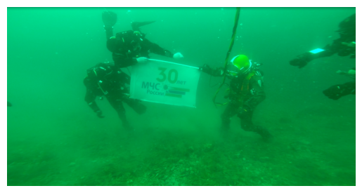

# underwater-enhancement

A Python implementation of Paper [C. O. Ancuti, C. Ancuti, C. De Vleeschouwer, and P. Bekaert, “Color Balance and Fusion for Underwater Image Enhancement,” *IEEE Trans. on Image Process.*, vol. 27, no. 1, pp. 379–393, Jan. 2018.](https://ieeexplore.ieee.org/document/8058463/) based on OpenCV.

### A Short Glimpse of Paper

The **color and visibility** of underwater images are degraded by the adverse effects of light **absorption and scattering** due to particles in the water, which results in foggy appearance and contrast degradation.

Traditional image enhancement methods show limitations on underwater image.

#### Observation and Model

The characteristic of selective attenuation w.r.t. the wavelength of light.

The attenuation rate $\beta$ can be drawn from the absorption and the scattering.
$$

a(\lambda)&={\mathrm d\over\mathrm dr}{\Phi_a(\lambda)\over\Phi_i(\lambda)}\\
s(\lambda)&={\mathrm d\over\mathrm dr}{\Phi_s(\lambda)\over\Phi_i(\lambda)}\\
\beta(\lambda)&=a(\lambda)+s(\lambda)

$$

The final attenuated light is given by
$$

L_{\rm attenuated}&=e^{-\beta d}L_{\rm original}

$$
where $d$ denotes the depth from object to camera.

#### Methods

- underwater image enhancement method
- underwater image restoration method
- supplementary-information specific method

##### Overview

White balancing aims at compensating for the color cast caused by the selective absorption of colors with depth, while image fusion is considered to enhance the edges and details of the scene and to mitigate the loss of contrast resulting from back-scattering.

##### White balancing

White balancing methods make a specific **assumption** t estimate the color of the light source, and then achieve color constancy by dividing each color channel by its corresponding **normalized light source intensity**.

- Gray World

  the average reflectance in the scene is **achromatic**

  **average** each channel independently

- Max RGB

  maximum response in each channel is caused by a **white patch**

  employ the **maximum** response of the different color channels

- Shades of Gray

  The authors of this algorithm found that both Gray World and Max RGB are the special cases of image color channel shift based on Minkowski p-norm ($p_1$ and $p_\infty$).

  By further exploration, $p_6$ seems to be the best p-norm and is adopted in Shades of Gray.

- Gray Edge

  improvement of Shades of Gray

  the average edge difference in a scene to be achromatic

  computer the scene illumination color by applying the Minkowski p-norm on the **derivative structure** of image channels

In the result of Gray World, an overcompensation of red channel is caused by the very small mean value, which results in severe red artifacts.

Step

- compensate for the loss of red channel
- adopt Gray World algorithm

Observation and Improvement

- green channel is well preserved, compared to the red and blue ones

- green channel contains opponent color information compared to the red one

  add a fraction of the green channel to red

- Gray world assumption

  the compensation is proportional to the difference between the mean green and the mean red values

- avoid saturation of the red channel during the Gray World step

  the enhancement of red should primarily affect the pixels with small red channel values, and should not change pixels that already include a significant red component.

$$

I_{rc}(x)=I_r(x)+\alpha(\bar I_g-\bar I_r)(1-I_r(x))I_g(x)

$$

In turbid water, the blue channel may be significantly attenuated as well.
$$

I_{bc}(x)=I_r(x)+\alpha(\bar I_g-\bar I_b)(1-I_b(x))I_g(x)

$$

##### Contrast Stretching

The framework builds on a set of inputs and weight maps derived from a single original image.

A pair of inputs is introduced to respectively enhance the **color contrast** and the **edge sharpness** and the weight maps are defined to **preserve the qualities** and **reject defaults** of those inputs.

- first input: Gamma correction

  correct the global contrast since underwater image tend to be bright
  $$
  
  \Gamma=I^{\gamma}
  
  $$
  at the cost of a loss of details in the under-or-over-exposed regions

- second input: sharpness

  blend a blurred or not sharp version of the image with the image to sharpen
  $$
  
  S=I+\beta(I-G*I)
  
  $$
  the selection of $\beta$ is not trivial, thus switch to a different approach
  $$
  
  S=(I+\mathcal N\{I-G*I\})/2
  
  $$
  where $\mathcal N$ denotes the histogram stretching operator, which shifts and scales all the color pixel intensities of an image so that the set of transformed pixel values cover the entire available dynamic range.

The weight maps are used during blending in such a way that pixels with a high weight value are more represented in the final image.

- Laplacian contrast weight

  the absolute value of a Laplacian filter

  straightforward but fail to distinguish between a ramp and flat regions

- Saliency weight

  employ saliency estimator

  favor highlighted areas

- Saturation weight
  $$
  
  W_{\rm sat}=\left(\frac13\left[(R_k-L_k)^2+(G_k-L_k)^2+(B_k-L_k)^2\right]\right)^{1/2}
  
  $$

##### Multi-scale fusion

Following the traditional multi-scale fusion strategy, each source input $I_k$ is decomposed into a Laplacian pyramid (which basically contains bandpass filtered version at different scales) while the normalized weight maps $\bar W_k$ are decomposed using a Gaussian pyramid.
$$

\bar W_k&={W_k+\delta\over\sum_{k=1}^KW_k+K\delta}\\
\mathcal R_l(x)&=\sum_{k=1}^KG_l\{\bar W_k(x)\}L_l\{I_k(x)\}

$$

### Parameters in Formulas

$$

I_{rc}(x)=I_r(x)+\alpha(\bar I_g-\bar I_r)(1-I_r(x))I_g(x)

$$

- `red_c`: $\alpha$

$$

I_{bc}(x)=I_r(x)+\alpha(\bar I_g-\bar I_b)(1-I_b(x))I_g(x)

$$

- `blue_c`: $\alpha$

$$

S=I+\beta(I-G*I)

$$

- `kernel_size`: kernel size of Gaussian Blur
- `sharp_gamma_c`: gamma correction coefficient of $I$ when sharpening
- `sharp_c`: $\beta$

$$

\Gamma=I^{\gamma}

$$

- `gamma_c`:  $\gamma$ gamma correction coefficient when adjusting luminance

### Reproduction

These images come from Internet and are enhanced by my implementation (not in original-resolution).

